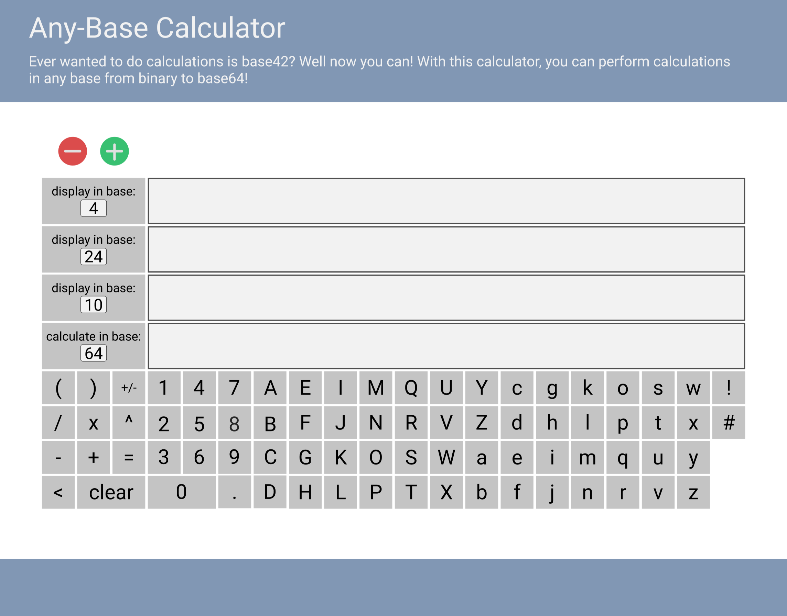

# Context
I want to practice the React I've learnt so far, and what better way than to do a project? This one will be an any-base calculator, where people can do calculations in any base from binary to base64.

A calculator seems like a good project for React since there are a lot of repeated DOM elements (lots of buttons and output displays).

My goal is to finish this project and deploy it over the next three days.

## Design mock up
